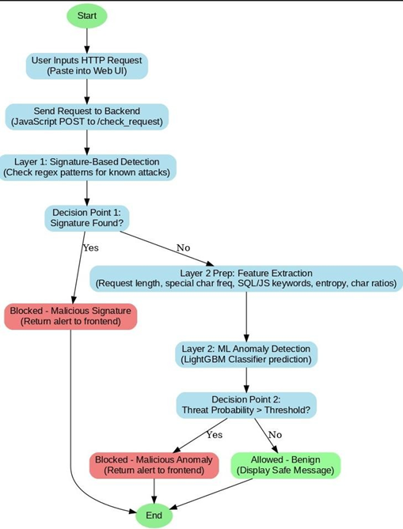
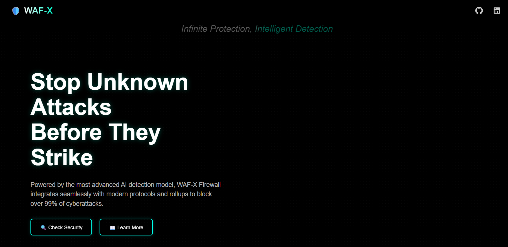
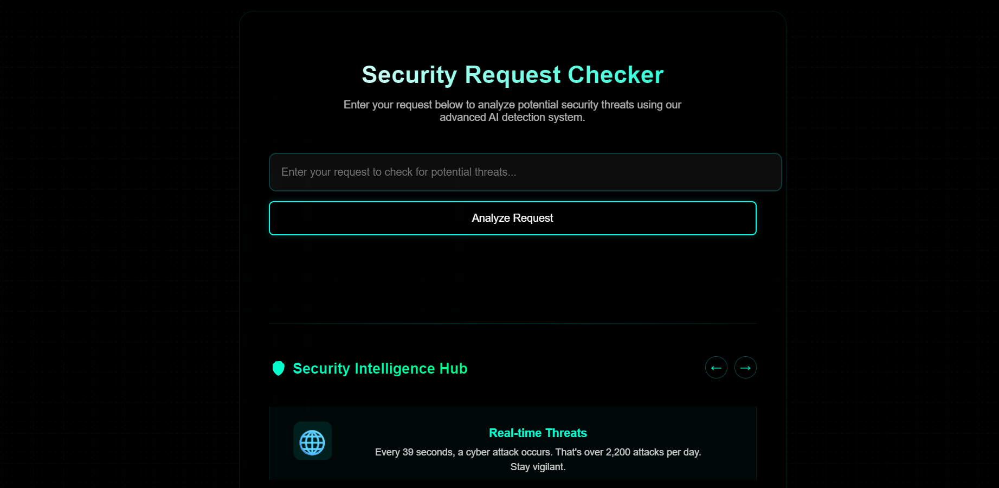
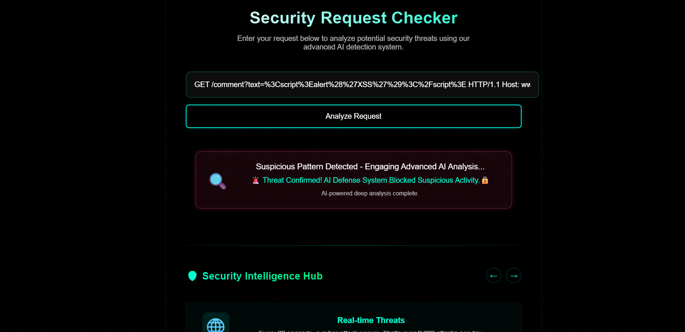

# 🛡️ WAF-X — Adaptive Web Application Firewall with Intelligent Threat Detection

**WAF-X** is an **Advanced Web Application Firewall (WAF)** built to protect modern web applications from **known** and **unknown** attacks — including SQL Injection, Cross-Site Scripting (XSS), and **encoded or obfuscated payloads**.  

Unlike traditional WAFs, **WAF-X** combines **Signature-based Filtering** with **Anomaly-based Machine Learning Detection** to dynamically adapt to new threats.  
It evaluates HTTP traffic, learns from request patterns, and intelligently blocks suspicious activity — without compromising performance.

---

## 🌐 System Overview  

<p align="center">
  
</p>

---

## ⚙️ Key Features  

| Capability | Description |
|-------------|-------------|
| 🚫 **Signature-based Blocking** | Detects and blocks known attack patterns (SQLi, XSS, CSRF, etc.) |
| 🤖 **ML-powered Anomaly Detection** | Identifies encoded, obfuscated, and zero-day attacks using trained models |
| 🧮 **Model Comparison Framework** | Evaluates multiple ML models to ensure the best detection accuracy |
| 🛡️ **Real-time Traffic Monitoring** | Filters and inspects every HTTP request before it reaches your app |
| 📊 **Interactive Dashboards** | Live analytics for detailed threat visualization and analysis |
| ✨ **Modern Web UI** | Clean, responsive interface for quick management |
| ⚡ **High Performance** | Flask-based backend optimized for low latency and scalability |

---

## 🧠 How It Works  

WAF-X employs a **hybrid detection architecture** that integrates both **static analysis** and **machine learning-based anomaly detection**.  

1. **Signature-based Filtering** → Uses pattern matching to detect and block known malicious payloads such as SQLi, XSS, and CSRF.  
2. **Anomaly Detection via ML Models** → Analyzes HTTP request features (payload entropy, header values, encoded characters, etc.) using trained classifiers.  
3. **Comparative Model Evaluation** → Multiple models (Random Forest, SVM, Logistic Regression, XGBoost, LightGBM) were tested — with **XGBoost and LightGBM** achieving the highest detection accuracy and lowest false positive rate.  
4. **Adaptive Behavior Profiling** → Continuously refines detection thresholds based on incoming traffic patterns.  
5. **Intelligent Response Engine** → Automatically blocks, logs, or flags requests based on severity levels.  

This hybrid approach ensures that WAF-X can **detect both rule-based and behavior-based anomalies**, offering superior protection against emerging attack vectors.

---

## 🖥️ Output Screenshots  

<p align="center">Screenshot 1: WAF-X Overview</p>
<p align="center">
  
</p>

<p align="center">Screenshot 2: WAF-X Dashboard</p>
<p align="center">
  
</p>

<p align="center">Screenshot 3: WAF-X Traffic Analysis</p>
<p align="center">
  
</p>


---

## 🧩 Tech Stack  

| Layer | Technologies Used |
|--------|-------------------|
| **Backend** | Python, Flask |
| **Frontend** | HTML, CSS, JavaScript |
| **ML Models** | XGBoost, LightGBM |
| **Data Handling** | Pandas, NumPy |
| **Visualization** | Matplotlib / Chart.js |
| **Deployment** | Gunicorn / Docker-ready |

---

## 🔍 Example HTTP Requests  

### ✅ Safe Requests  

**1. Homepage**
```
GET / HTTP/1.1
Host: www.example.com
```

**2. Product listing**
```
GET /products?category=electronics&page=2 HTTP/1.1
Host: www.ecommerce.com
Referer: https://www.ecommerce.com/products
```

**3. Single product**
```
GET /product/12345 HTTP/1.1
Host: www.ecommerce.com
Referer:https://www.ecommerce.com/products?category=electronics&page=2
```

**4. Add to cart (POST with JSON body)**
```
POST /cart/add HTTP/1.1
Host: www.ecommerce.com
Content-Type: application/json
Content-Length: 45

{"productId": "12345", "quantity": 1}
```

### ❌Signature-Based Detection (Malicious Input)

**1. SQL Injection via search**
```
GET /search?q=' OR '1'='1'; DROP TABLE users;-- HTTP/1.1
Host: www.example.com
```

**2. XSS in comment**
```
GET /comment?text=<script>alert('XSS')</script> HTTP/1.1
Host: www.example.com
```

**3. XSS using eval**
```
GET /comment?text=<script>eval(String.fromCharCode(97,108,101,114,116,40,39,88,83,83,39,41))</script> HTTP/1.1
Host: www.example.com
```

**4. SQL Injection with UNION**
```
GET /search?q=1' UNION SELECT username,password FROM users-- HTTP/1.1
Host: www.example.com
```

### 🚨  ML-based Anomaly Detection (Obfuscated Malicious Input/Encoded Attacks)

**1. URL-encoded SQLi**
```
GET /search?q=%27%20OR%20%271%27%3D%271 HTTP/1.1
Host: www.example.com
```

**2. Hex-encoded SQLi**
```
GET /search?q=\x27\x20OR\x20\x31\x3D\x31 HTTP/1.1
Host: www.example.com
```

**3. Obscure HTML Elements + JS Access**
```
GET /comment?text=<details%20open%20ontoggle=Function('ale'+'rt(1)')()> HTTP/1.1
```

**4. Encoded XSS**
```
GET /comment?text=%3Cscript%3Ealert%28%27XSS%27%29%3C%2Fscript%3E HTTP/1.1
Host: www.example.com
```

## 🛠️Setup

1. Clone the repository:

bash
```
git clone https://github.com/YOUR_USERNAME/Advanced-WAF-WAFinity.git
```
```
cd Advanced-WAF-WAFinity
```

2. Install dependencies:

bash
```
pip install -r requirements.txt
```

3. Run the application:

bash
```
python app.py
```

## License

MIT License
" > README.md

## Add and commit README
git add README.md
git commit -m "Add README.md"
git push
